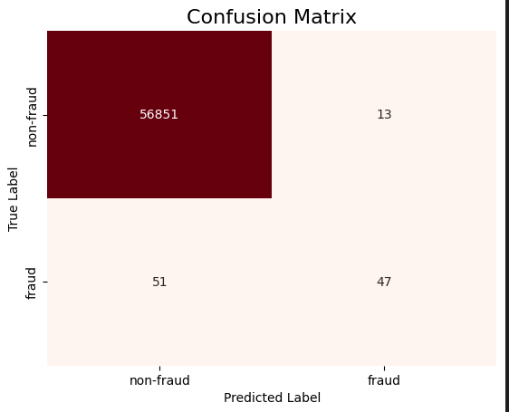

# Fraud Shield: Credit Card Fraud Detection

This project uses Logistic Regression to identify fraudulent credit card transactions. The goal is to build a reliable system that can distinguish between legitimate and suspicious financial activities.

---

## Project Results & Visualization
Below is the **Confusion Matrix** which shows exactly how the model performed on the test data:

### Model Performance Metrics:
* **True Negatives (Correctly identified normal):** 56,851
* **True Positives (Correctly identified fraud):** 47
* **False Positives (Normal flagged as fraud):** 13
* **False Negatives (Missed fraud cases):** 51

> **Insight:** The very low number of **False Positives (13)** indicates that the model is highly efficient at not bothering legitimate customers with false alarms.

---

## Dataset Information
The dataset used in this project is the **Credit Card Fraud Detection** dataset from Kaggle. 
* Due to its large size, it is not included in this repository.
* You can download it here: [Kaggle Dataset Link](https://www.kaggle.com/datasets/deepikaarikesavan/credit-card-fraud-detection-dataset)
* **Note:** To run the code, ensure the downloaded file is named `creditcard.csv` and placed in the same folder as the notebook.

---

## Project Overview
The model was trained on a dataset of over 284,000 transactions. The primary challenge was the high imbalance in the data, which was handled through normalization and careful feature scaling.

---

## Key Technical Details
* **Data Preparation**: Scaled features and split the dataset into training and testing sets.
* **Model Used**: Logistic Regression.
* **Performance**: The model achieved an overall accuracy of 99.58%.

---

## Files in this Repository
* **Fraud_Shield.ipynb**: Main notebook with the Python implementation.
* **requirements.txt**: List of Python libraries used (Pandas, Scikit-Learn, etc.).
* **confusion_matrix.png**: Visualization of model performance.
* **transaction_distribution.png**: Visualization of data analysis.

---
## Team Members
* Abdulrahman Aljeelani
* Abdulrahman Jilani
* Omar Mahdi
* Rashed AlRadadi

* Hamza Jan

